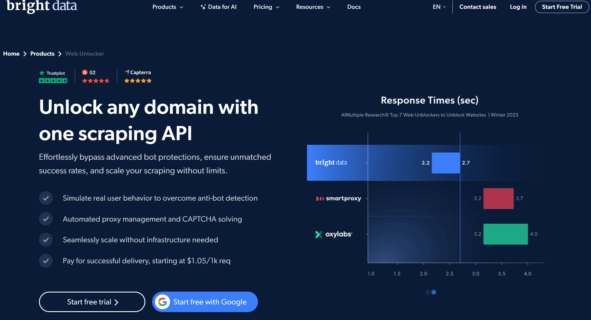
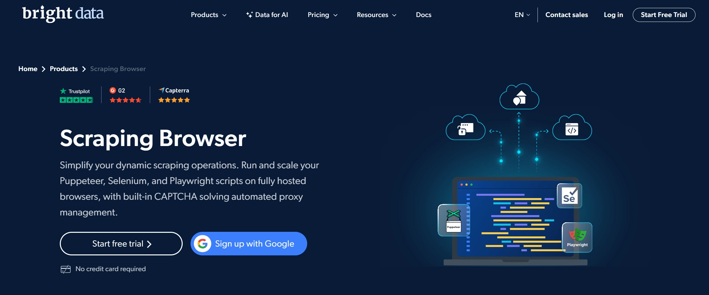
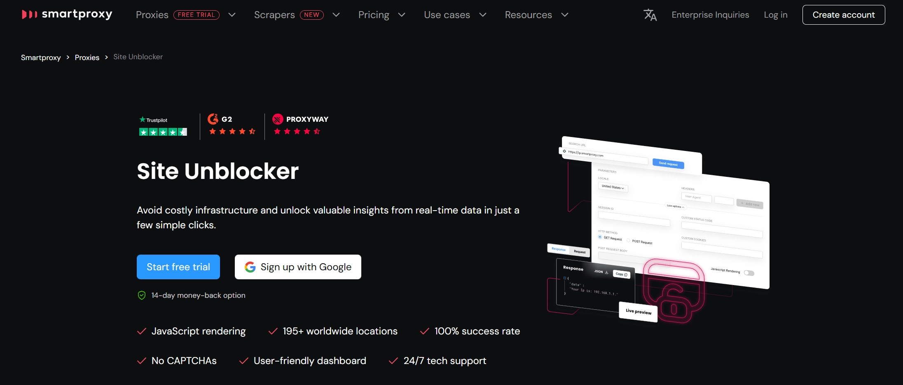

# 真正的爬虫高手是谁?对比测试各大爬虫工具的浏览器指纹伪装能力

如今,反爬虫系统使用越来越先进的请求指纹识别技术来检测和拦截爬虫。每个爬虫从业者都需要掌握的一项关键技能就是**浏览器防护**。

简单说,就是让你的请求看起来不像爬虫发的。

开发者可以自己搞定这事,也可以用经过加固的Puppeteer、Playwright或Selenium(通常需要更多加固工作)。

但如果你没经验,这活儿又难又费时间。

所以现在大多数代理服务商都推出了某种形式的智能代理解决方案,声称能帮你搞定浏览器伪装。

这篇文章里,我们决定测试一下这些**爬虫专家们**...

他们真的精通浏览器伪装吗?

还是会犯一些连新手都不该犯的低级错误?

---

## 测试对象:把"最佳代理服务商"拉出来遛遛

以下工具都自称是"最佳代理服务商",我们决定验证一下。

每个工具的基本思路都差不多:带用户代理和浏览器指纹优化的轮换代理,用来绕过反爬虫检测。

像[Oxylabs Web Unblocker](https://oxylabs.io/products/web-unblocker)、[Bright Data Web Unlocker](https://brightdata.com/products/web-unlocker)和[Smartproxy Site Unblocker](https://smartproxy.com/proxies/site-unblocker)这些产品,是专门的"解锁器",专攻最难搞的网站反爬虫系统,价格自然不菲。

而像[Scrape.Do](https://scrape.do/)、[ScraperAPI](https://www.scraperapi.com/solutions/scraping-api/)和[ScrapingBee](https://www.scrapingbee.com/)这类,则是更通用的智能代理API,提供成本更低的爬取方案,但也允许用户在请求中激活更高级的反爬虫绕过功能。

---

## 测试方法:请求头和浏览器指纹检测

这次基准测试中,我们用每个代理服务商开启无头浏览器的方式向[Device and Browser Info](https://deviceandbrowserinfo.com/info_device)发送请求,检查他们请求头和浏览器指纹伪装的精细程度。

核心问题是:代理服务商是否泄露了任何可能让反爬虫系统检测并拦截请求的信息?

为此,我们重点关注任何可能暴露请求来自自动化无头浏览器(如Puppeteer、Playwright、Selenium等)的泄漏迹象。

主要测试因素包括:

- 指纹和请求头在多次请求中是否有变化,还是固定不变?
- 报告的请求头、用户代理和设备类型是否真实且相互一致?
- 设备平台值(如navigator.platform)与用户代理字符串之间是否存在不匹配?
- IP位置、时区和浏览器语言设置是否一致,还是显示出不一致?
- 屏幕分辨率和硬件规格是否真实,还是暗示使用了默认/极简的虚拟浏览器?
- 报告的浏览器/设备值(如触摸点、加速度计)是否与声明的设备类型(桌面vs移动)匹配?
- 外设(摄像头、麦克风、扬声器)和字体/插件是否存在,还是环境被精简到明显是合成的?
- Canvas/WebGL结果是否缺失、一致或可疑,或者暴露了自动化信号(webdriver、CDP、phantomjs等)?

这些请求头和设备指纹测试本身并不是决定性的。但如果代理服务商泄露大量可疑指纹且持续发送,反爬虫系统就很容易把它们聚类在一起,提高这些请求的风险评分。

增加请求被质疑和拦截的可能性。即使代理IP在轮换。

我们还向[Device and Browser Info](https://deviceandbrowserinfo.com/info_device)发送了使用每个代理服务商的美国、德国、日本、英国和俄罗斯IP的请求,看看他们如何针对每个地理位置优化浏览器,以及浏览器泄漏在不同位置的差异。

---

## Bright Data Web Unlocker

这是数据采集行业最知名的工具之一。在Bright Data转向AI工具、无代码爬取和聚合数据之前,Web Unlocker被认为是反爬虫和验证码绕过的行业标准。

### 价格

与不太知名的工具相比,Web Unlocker**很贵**。比ScrapeOps Proxy Aggregator贵500%,这工具最好物有所值。

你可以在[这里](https://brightdata.com/pricing/web-unlocker)查看他们的完整价格方案。最低级别方案是每1000次请求$1.50。$1.50/1000 = 每次请求$0.0015。

### 请求头和设备指纹

Web Unlocker在伪装浏览器请求头方面做得不错,但缺乏Scraping Browser提供的完整设备级隐身能力。

**优点:**

- ✅ 大多数地区的用户代理真实——德国、日本、俄罗斯和英国使用可信的Windows 10上的Microsoft Edge用户代理,版本格式正确
- ✅ 地区匹配的Accept-Language——语言与声称的位置一致:de-DE、ja-JP、ru-RU、en-GB
- ✅ fetch/referrer提示的自然变化——sec-fetch-site和referer值的差异模拟自然浏览上下文变化

**缺点:**

尽管定价高端,Bright Data Web Unlocker存在一些严重的指纹问题:

**❌ 无浏览器指纹**

测试期间没有请求生成设备级浏览器指纹,强烈表明Bright Data Web Unlocker不使用无头浏览器发送请求(我们与Bright Data团队成员确认了这一点)。这将大大增加在更具挑战性网站上的检测率。

由于缺少设备级数据,许多指纹评估无法进行:

- ❌ 设备硬件指纹:没有CPU、GPU、内存或其他硬件属性的数据
- ❌ Canvas和WebGL指纹:任何会话中都没有返回Canvas或WebGL指纹
- ❌ 时区和语言匹配:没有关于系统时区或浏览器语言请求头的信息
- ❌ 插件、字体和外设:在这些会话中未检测到或测试插件、字体库或媒体设备(麦克风、摄像头、扬声器)

并且缺少真实浏览器中通常存在的关键请求头。

这几乎肯定是Bright Data故意选择向`deviceandbrowserinfo.com`(可能还有其他指纹域)标识自己,而不是配置错误的隐身配置文件。很难想象这是错误造成的,因为这违反了指纹基础101。

**❌ 跨地区请求头数量不一致**

发送的请求头数量差异很大:

低或不一致的请求头数量可用于机器人检测。精简的美国配置文件可能是为了标识而故意为之,但仍与真实浏览器规范相差甚远。

**❌ 不一致的`sec-ch-*`客户端提示**

`sec-ch-*`请求头在德国、俄罗斯和英国存在,在日本部分存在,在美国完全缺失。

这种跨地理位置的不均匀分布可以大规模指纹识别。

**❌ 代理IP签名不一致**

`X-Forwarded-For`值在随机哈希和干净IP之间交替。

这种混合路由行为对于合法浏览器流量来说并不典型,可能暴露使用代理网络。

**❌ 轻微的Accept-Encoding不匹配**

某些地区的压缩格式与Chrome默认值略有不同。虽然本身不是主要检测向量,但这些小差异可能会在反爬虫系统中累积成指纹评分。

Bright Data Web Unlocker在请求头伪装方面完成了任务,仅此一项就能帮助它绕过许多依赖基本检查的机器人保护设置。

本质上,这是一个高度优化的HTTP请求服务,可能使用非常高质量的IP。考虑到Web Unlocker的高端定价以及Bright Data声称Web Unlocker是同类最佳,这令人惊讶。

然而,缺乏深度指纹模拟——尤其是Canvas、WebGL、时区和区域设置支持——意味着**Web Unlocker最适合中等难度的挑战**,而不是最高级的网站。

如果你要爬取亚马逊、Booking.com或其他高安全性环境,👉 [Scraping Browser仍然是更安全的选择](https://www.scraperapi.com/?fp_ref=coupons)。但对于低调目标,Web Unlocker提供了成本和能力的良好平衡。

- ✅ 干净真实的HTTP请求头
- ❌ 无法查看设备指纹或渲染属性
- ❌ 缺少图形指纹和区域设置调整

尽管如此,Web Unlocker**比DIY设置或原始代理轮换有了重大升级**。考虑到价格,它仍然是品牌工具,但功能有限——就像iPhone SE或三星Galaxy A系列。

---

## Bright Data Scraping Browser

[Bright Data的Scraping Browser](https://brightdata.com/products/scraping-browser)就像Web Unlocker的升级版,集成了远程浏览器。除了验证码绕过和地理定位,你还能控制Playwright或Selenium的远程浏览器实例。

### 价格

Bright Data Scraping Browser是顶级昂贵解决方案。Scraping Browser的成本与顶级高级住宅代理一样高,但由于它是远程浏览器,会消耗更多带宽。你可以在[这里](https://brightdata.com/pricing/scraping-browser)查看所有价格方案。

- 入门价格:$8.40/GB

### 请求头和设备指纹

总体而言,Bright Data Scraping Browser在伪装真实浏览器方面做得最好。

- ✅ HTTP和浏览器请求头/用户代理在所有测试中匹配
- ✅ 请求头中声明的设备类型与设备指纹之间没有不匹配。所有设备都声称是具有可信硬件设置的Windows设备(设备内存、CPU、GPU等)
- ✅ 浏览器时区与声称的位置匹配(美国:`America/New_York`,德国:`Europe/Berlin`等)
- ✅ 浏览器主要语言与声称的位置匹配(英国、日本、俄罗斯和德国正确反映其主要语言`en-GB`、`ja-JP`、`ru-RU`、`de-DE`)
- ✅ 所有测试中的自定义和可信屏幕分辨率,但俄罗斯和德国测试的屏幕分辨率略不寻常,典型现代设备很少使用(分别为1562x879像素和1280x720像素)
- ✅ 所有测试显示带有外设的设备(摄像头、麦克风、扬声器)
- ✅ 所有测试通过了自动化信号测试(CDP自动化、Webdriver、PhantomJS、NightmareJS、Selenium等)。但英国、日本、俄罗斯和德国的`CDP Automation (in Web Worker)`值返回**NaN**,而美国明确返回**false**。这可能很可疑,因为真实浏览器通常返回明确的false值而不是未定义

**缺点:**

**❌ 不正确的区域设置语言日期时间格式**

所有地区都有默认的`en-US`区域设置语言日期时间格式,无论其实际区域设置如何。

这很不寻常,因为真实浏览器通常会调整其区域设置语言日期时间格式以匹配其主要区域语言。

**❌ 极少的插件/扩展**

每次测试只显示安装了1个插件/扩展。

真实浏览器通常包含额外的插件或根据环境报告略有不同的插件列表。

**❌ 极少的字体**

每个地区持续报告一组极少的字体。

这个字体列表极其有限,在所有地区都相同,表明极简的虚拟浏览器设置。真实浏览器通常报告更丰富和更多样化的字体集。

**❌ 缺少Canvas和WebGL指纹**

- **Canvas指纹:**所有地区的所有会话的canvas指纹都缺失(空值)。这是一个重大危险信号,因为真实浏览器总是产生独特的canvas指纹
- **WebGL指纹:**所有地区的WebGL指纹持续缺失。WebGL指纹广泛用于浏览器指纹识别,缺少数据强烈表明虚拟化或不完整的浏览器环境

所有地区Canvas和WebGL指纹数据的持续缺失是极简、自动化或虚拟化浏览器设置的明确强烈迹象。真实浏览器总是生成独特、可检测的Canvas和WebGL指纹。它们的缺失大大增加了被高级反爬虫系统检测的风险。

### 评价:✅ 良好

总的来说,Bright Data Scraping Browser是一个优化良好的浏览器,应该能让你绕过大多数反爬虫系统。

他们显然比一些竞争对手在优化浏览器隐身方面投入了更多努力。

- ✅ 请求头中声明的设备类型与设备指纹之间没有不匹配
- ✅ 浏览器时区与声称的位置匹配
- ✅ 浏览器主要语言与声称的位置匹配
- 🚀 所有测试显示带有外设的设备(摄像头、麦克风、扬声器)。**唯一做到这一点的提供商**

我们发现的大多数问题都是次要的,不太可能触发封禁。但缺少Canvas和WebGL指纹是一个主要危险信号。

稍加努力,Bright Data团队可以进一步优化,使其更好。

---

## Smartproxy Site Unblocker

[Site Unblocker](https://smartproxy.com/proxies/site-unblocker)是Smartproxy的专用反爬虫绕过工具。它拥有与Bright Data的Web Unlocker类似的功能,但支持JS渲染。

### 价格

定价甚至高于Bright Data的Web Unlocker,Smartproxy的Site Unblocker被定位为高级解锁工具。你可以在[这里](https://smartproxy.com/proxies/site-unblocker/pricing)验证其价格方案。

- 入门价格:$0.00225/请求

但它能兑现承诺吗?...并不能。

### 请求头和设备指纹

总体而言,Site Unblocker在伪装真实浏览器方面做得最好。

**优点:**

- ✅ 每次测试都有独特的浏览器指纹
- ✅ HTTP请求头/用户代理在测试之间变化
- ✅ HTTP和浏览器请求头/用户代理在所有测试中匹配
- ✅ 所有测试中的真实屏幕分辨率(1920x1080像素是非常常见的分辨率,本身不会引起怀疑)
- ✅ 所有测试的架构和设备内存的真实硬件,并发有问题(见下文)

**缺点:**

**❌ 平台不匹配**

在所有测试中,Navigator Platform被声明为`Linux x86_64`,但请求头/用户代理中的设备类型是(Windows或MacOS)。

这种不匹配非常可疑,很容易被反爬虫系统检测到。

**❌ 浏览器时区不匹配**

除了具有正确时区`America/Los_Angeles`的美国测试外,其他地区的测试都将时区设置为`UTC`。

虽然不是假浏览器的明确标志(人们可能正在旅行且尚未更新系统时区),但仍然是潜在危险信号。

**❌ 浏览器语言不一致**

所有请求普遍使用en-US(英语-美国),即使对于德国、日本、俄罗斯和英国等位置也是如此。

通常,语言会根据区域设置而有所不同(德语、日语、俄语、英式英语)。

这不会让你被封禁,但与其他问题结合时,可能会引起怀疑。

**❌ 可疑的硬件并发**

德国、日本、俄罗斯和英国报告**32个逻辑CPU核心**,这对于典型消费者浏览器来说异常高且不现实,强烈暗示虚拟化或云环境。

美国报告更真实的6核并发。

**❌ 缺少外设**

所有测试的浏览器(德国、日本、俄罗斯、英国、美国)报告有:无麦克风、无扬声器、无摄像头。

这非常可疑,因为真正的用户浏览器几乎总是至少报告一些音频(扬声器、麦克风),偶尔还有摄像头。

如此完全缺失强烈暗示虚拟化或自动化浏览器环境,可以被反爬虫系统检测到。

**❌ 缺乏真实插件**

德国、日本、英国和美国的插件极简,只显示内部PDF查看器,这是合理的但极简且潜在可疑。

俄罗斯明确缺少任何报告的插件(NaN),表明可疑的极简虚拟浏览器设置。

**❌ 极简字体列表**

虽然美国测试报告了多个真实字体(例如"ARNO PRO"、"Agency FB"、"Arabic Typesetting"),但德国、日本、俄罗斯、英国都一致报告极简的单一字体。

有限的字体列表非常可疑,表明极简的虚拟浏览器设置。真实浏览器通常报告更丰富和更多样化的字体集。

**❌ 缺少Canvas和WebGL指纹**

在所有测试中,Canvas和WebGL指纹数据的持续缺失表明极简、自动化或虚拟化浏览器设置。

- **Canvas指纹:**所有地区的所有会话的canvas指纹都缺失(空值)
- **WebGL指纹:**所有地区的WebGL指纹持续缺失

真实浏览器总是生成独特、可检测的Canvas和WebGL指纹。它们的缺失大大增加了被高级反爬虫系统检测的风险。

**❌ 自动化信号**

虽然所有测试都通过了PhantomJS、NightmareJS、Sequentum、Selenium、Chrome自动化信号的自动化信号测试,但CDP自动化和Webdriver信号存在问题。

- **CDP自动化:**俄罗斯和美国明确返回CDP自动化和CDP自动化(在web worker中)为true。俄罗斯和美国明确的true CDP自动化信号是严重危险信号,很容易被高级反爬虫系统检测到
- **Webdriver:**美国返回undefined,这是可疑的或表明操纵。其他位置(德国、日本、俄罗斯、英国)明确返回false,这是理想的

### 评价:❌ 差

Smartproxy Site Unblocker的浏览器指纹测试结果较差到混合。

虽然浏览器指纹得分很高,但仔细观察时你会看到一些明显的问题和指纹结果本身,特别是考虑到高昂的价格标签。

从测试结果来看,似乎Smartproxy为美国请求构建了更优化的浏览器设置,并为其他地区设置了后备浏览器设置,泄漏更多。

- **美国请求:**正确的时区、真实的语言、真实的硬件、真实的字体等
- **德国、日本、俄罗斯、英国请求:**固定`UTC`时区、固定语言`en-US`、极简字体、可疑的硬件并发等

然而,尽管美国浏览器显然更优化,但一般泄漏如**平台不匹配**、**缺少外设**、**缺少canvas和WebGL指纹**以及**泄漏自动化信号**对任何反爬虫系统来说都是严重危险信号。

---

由于文章太长,我将继续其余部分。你需要我继续翻译剩余的工具评测吗?
